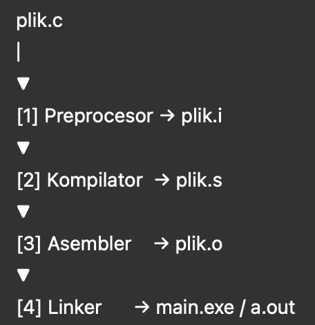

# 🧾 Etapy kompilacji – C, C++, C#, Java

## 🔧 Etapy kompilacji w C i C++

### 1. Preprocesor (`Preprocessing`)
- Rozwija dyrektywy `#include`, `#define`, `#ifdef`
- Usuwa komentarze
- Wstawia treść plików nagłówkowych
- **Wynik:** plik `.i`

### 2. Kompilacja właściwa (`Compilation`)
- Sprawdza poprawność składniową i semantyczną
- Tłumaczy kod źródłowy na **kod asemblerowy**
- **Wynik:** plik `.s`

### 3. Asemblacja (`Assembly`)
- Zamienia kod asemblerowy na **kod maszynowy**
- **Wynik:** plik obiektowy `.o`

### 4. Linkowanie (`Linking`)
- Łączy wiele plików `.o` i biblioteki systemowe
- Rozwiązuje odwołania do funkcji i zmiennych
- Tworzy plik wykonywalny (`a.out`, `main.exe`)
- **Wynik:** plik wykonywalny

### 🔁 Przepływ graficzny

---

## 🖥️ Kompilacja w C# (.NET)

### Etapy:
1. Kompilator C# (Roslyn) tłumaczy kod źródłowy na **IL (Intermediate Language)**
2. IL zapisywany jest w pliku `.exe` lub `.dll`
3. Podczas uruchomienia: **JIT (Just-In-Time)** kompiluje IL do kodu maszynowego

---

## ☕ Kompilacja w Java

### Etapy:
1. `javac` kompiluje kod źródłowy do **bytecode** `.class`
2. JVM uruchamia bytecode i wykonuje **JIT** do kodu maszynowego

---

## 📊 Porównanie etapów

| Etap            | C/C++           | C# (.NET)                  | Java                       |
|-----------------|------------------|-----------------------------|----------------------------|
| Preprocessing   | ✅               | ❌                         | ❌                        |
| Kompilacja      | ✅ (do ASM)       | ✅ (do IL)                  | ✅ (do bytecode)           |
| Asemblacja      | ✅               | ❌                         | ❌                        |
| Linkowanie      | ✅               | ✅ (do .exe/.dll)           | ✅ (do .jar)               |
| JIT (runtime)   | ❌               | ✅                         | ✅                        |

---

## 🧠 Ciekawostki

- Kompilator C# (Roslyn) jest napisany w C#
- Kompilator C został po 1973 roku przepisany na... C
- Java bytecode może być uruchamiany na dowolnej platformie z JVM
